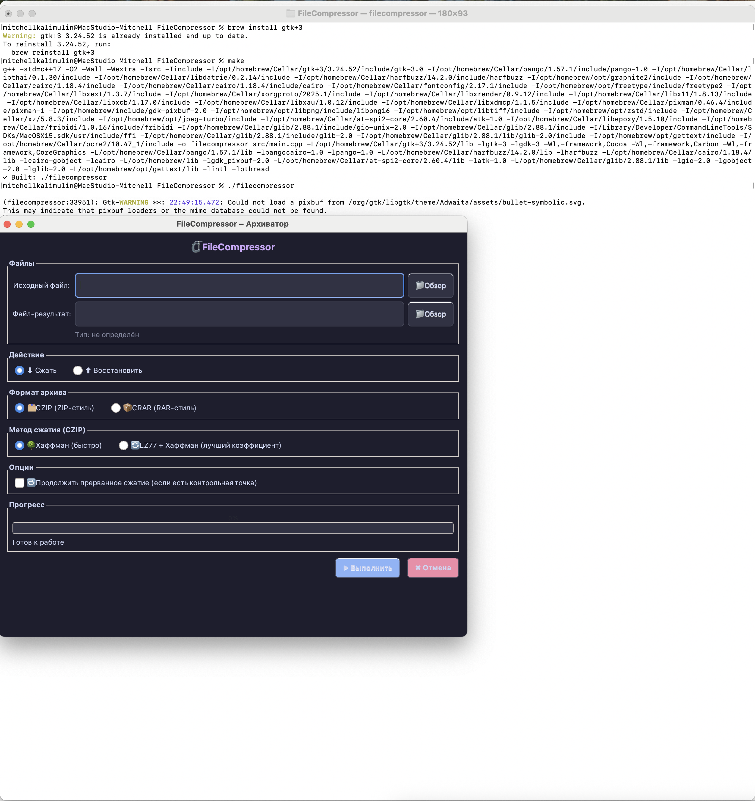
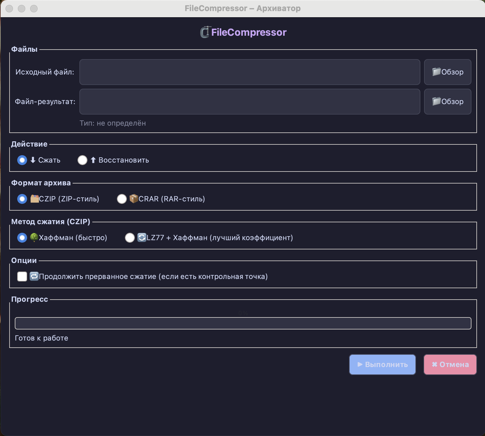
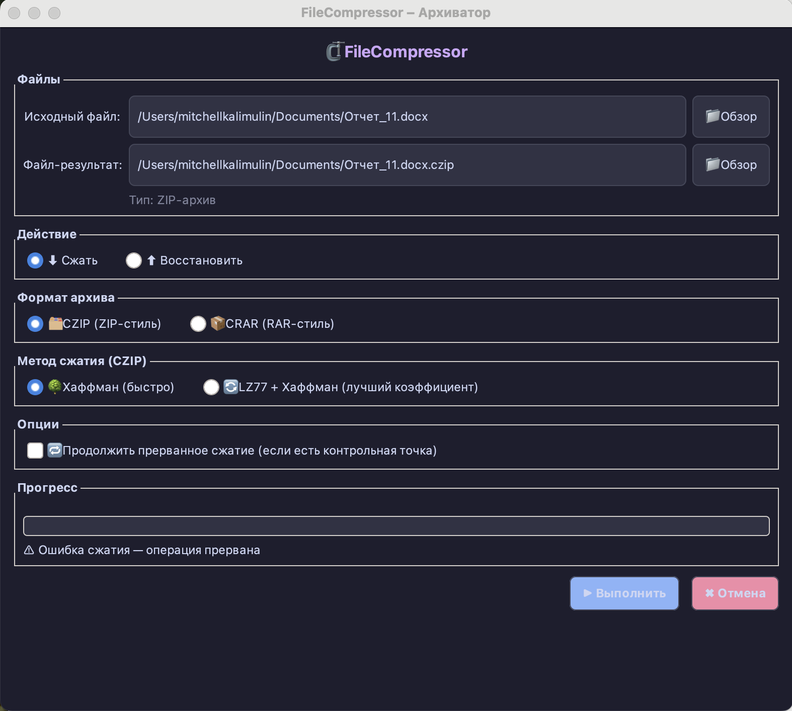
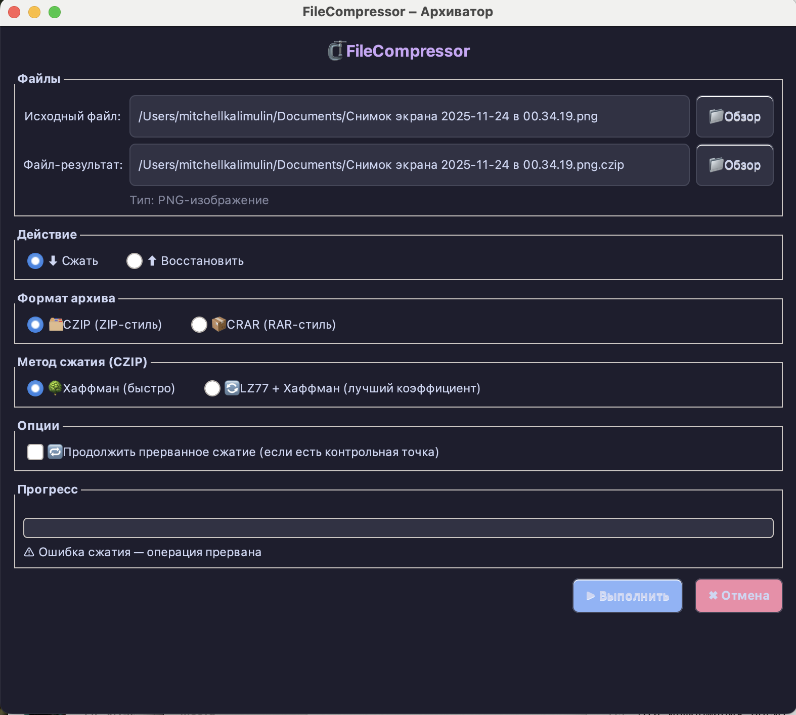
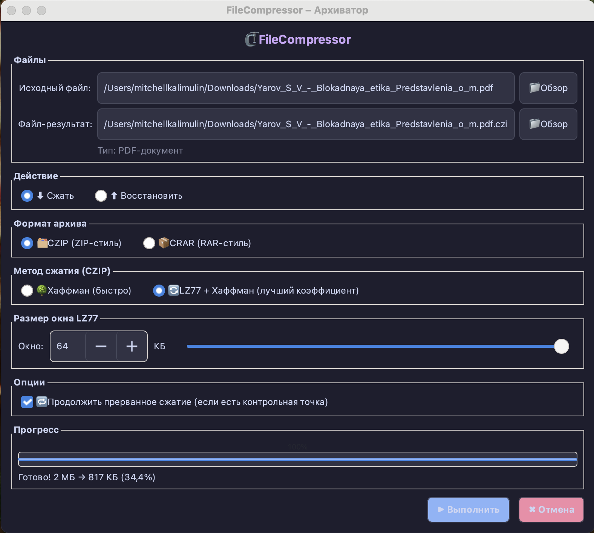
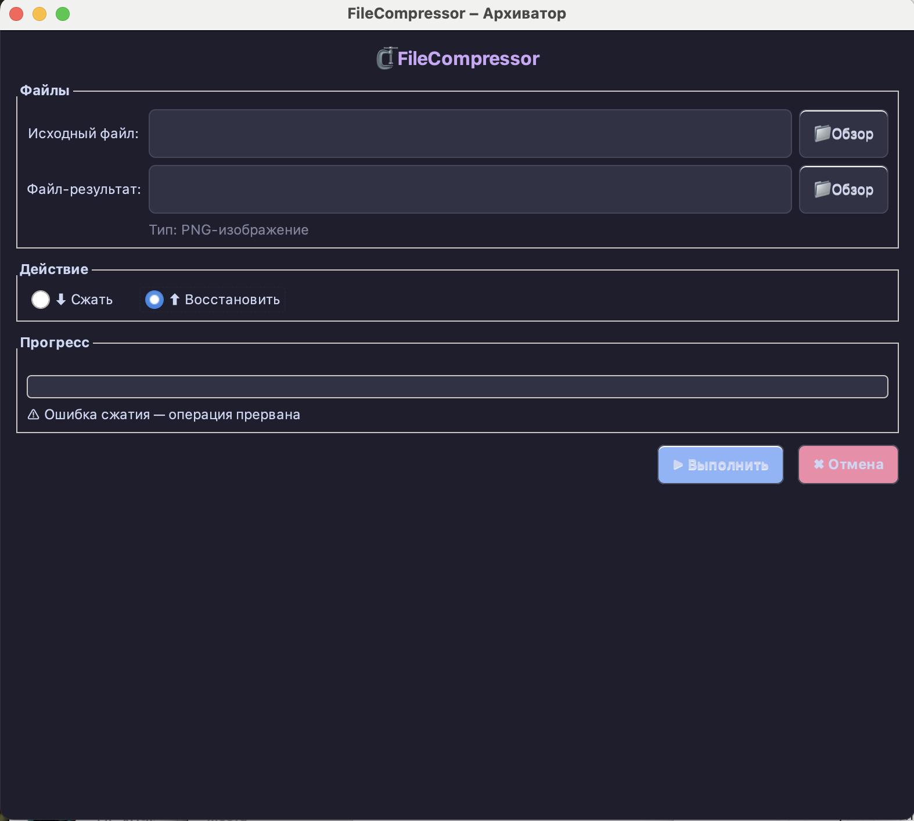
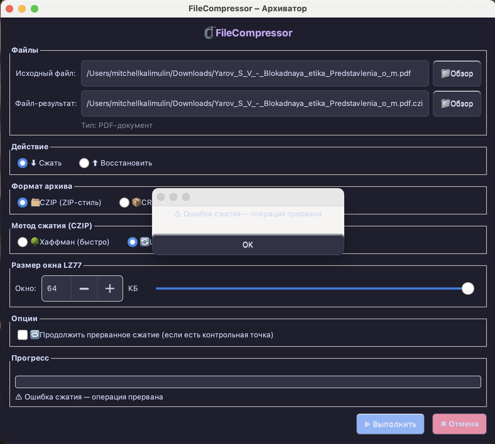
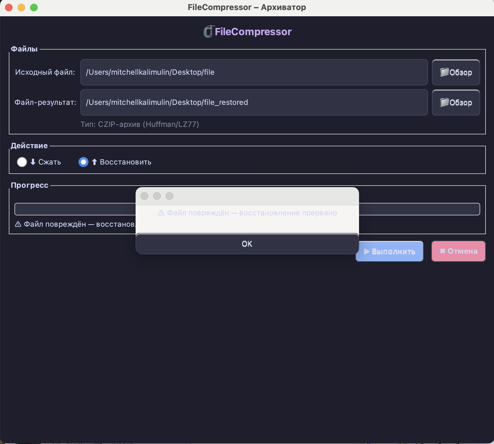

# Руководство пользователя — FileCompressor

**FileCompressor — Архиватор**  
Версия: 2.0 · Платформа: Linux / macOS · Интерфейс: GTK3

---

## Содержание

1. [Обзор программы](#1-обзор-программы)
2. [Установка и сборка](#2-установка-и-сборка)
3. [Интерфейс приложения](#3-интерфейс-приложения)
4. [Выбор файлов](#4-выбор-файлов)
5. [Автоопределение типа файла](#5-автоопределение-типа-файла)
6. [Форматы архивов](#6-форматы-архивов)
7. [Алгоритмы сжатия](#7-алгоритмы-сжатия)
8. [Настройка размера окна LZ77](#8-настройка-размера-окна-lz77)
9. [Режим сжатия и распаковки](#9-режим-сжатия-и-распаковки)
10. [Возобновление прерванного сжатия](#10-возобновление-прерванного-сжатия)
11. [Отмена операции](#11-отмена-операции)
12. [Индикатор прогресса и статус](#12-индикатор-прогресса-и-статус)
13. [Сообщения об ошибках](#13-сообщения-об-ошибках)

---

## 1. Обзор программы

FileCompressor — Архиватор — это десктопный архиватор с графическим интерфейсом на базе GTK3, написанный на C++17. Программа предоставляет три алгоритма сжатия, два формата архивов и набор дополнительных функций для надёжной работы с файлами любого размера.

**Ключевые возможности:**

- Три алгоритма сжатия: Huffman, LZ77 + Huffman, LZSS + RNC
- Два формата архива: CZIP и CRAR
- Чанковая обработка (512 КБ на чанк) — поддержка файлов любого размера
- Проверка целостности данных через CRC32 при распаковке
- Возобновление прерванного сжатия через контрольные точки (`.ckpt`)
- Автоматическое определение типа исходного файла по сигнатуре (magic bytes)
- Адаптивный выбор: если сжатый чанк оказывается крупнее исходного, он сохраняется как есть

---

## 2. Установка и сборка

### macOS

```bash
brew install gtk+3
make
```

### Linux (Debian / Ubuntu)

```bash
sudo apt install libgtk-3-dev
make
```

После успешной сборки запустите исполняемый файл из директории проекта.



---

## 3. Интерфейс приложения

Главное окно фиксированного размера (620 × 520 пикселей) разделено на несколько функциональных секций, расположенных вертикально:

| Секция | Описание |
|---|---|
| **Файлы** | Поля ввода путей к исходному файлу и файлу-результату с кнопками «Обзор» |
| **Действие** | Переключатель режима: «Сжать» или «Восстановить» |
| **Формат архива** | Выбор между CZIP и CRAR (только при сжатии) |
| **Метод сжатия** | Выбор алгоритма (только для формата CZIP) |
| **Размер окна LZ77** | Числовой ввод в КБ (только при выборе LZ77) |
| **Опции** | Флажок «Продолжить прерванное сжатие» |
| **Прогресс** | Полоса прогресса с процентом и текстовый статус |
| **Управление** | Кнопки «Старт» и «Отмена» |

Интерфейс оформлен в тёмной цветовой схеме (Catppuccin Mocha): фон `#1e1e2e`, текст `#cdd6f4`, кнопка «Старт» — синяя `#89b4fa`, кнопка «Отмена» — красная `#f38ba8`.



---

## 4. Выбор файлов

### Исходный файл

Введите путь вручную в поле «Исходный файл» или нажмите кнопку «Обзор», чтобы открыть стандартный диалог выбора файла операционной системы.

### Файл-результат

Поле «Файл-результат» заполняется **автоматически** при вводе исходного пути:

- В режиме **сжатия** к имени исходного файла добавляется расширение `.czip` или `.crar` в зависимости от выбранного формата.
- В режиме **восстановления** расширение `.czip` / `.crar` убирается. Если архивного расширения нет, к имени добавляется суффикс `_restored`.

Вы можете скорректировать итоговый путь вручную. При сохранении в уже существующий файл появится диалог подтверждения перезаписи.



---

## 5. Автоопределение типа файла

Сразу после выбора исходного файла программа анализирует его первые байты (magic bytes / сигнатуру) и отображает определённый тип рядом с полем ввода, например:

```
Тип: PNG Image
Тип: ZIP Archive
Тип: PDF Document
Тип: Unknown binary
```

Эта информация носит справочный характер и позволяет убедиться, что выбран правильный файл. На выбор алгоритма или формата она не влияет.



---

## 6. Форматы архивов

Секция «Формат архива» отображается только в режиме сжатия.

### CZIP

Формат ZIP-стиля. Поддерживает алгоритмы **Huffman** и **LZ77 + Huffman**.

**Когда использовать:** когда важна совместимость с настройками Huffman или требуется выбор конкретного алгоритма энтропийного кодирования.

### CRAR

Формат RAR-стиля. Использует алгоритм **LZSS + RNC** (чанки 4 КБ с контрольными суммами CRC16).

**Когда использовать:** для текстовых и структурированных данных, где LZSS даёт лучшее соотношение сжатия.

---

## 7. Алгоритмы сжатия

Секция «Метод сжатия» доступна только при выборе формата CZIP. Для CRAR алгоритм LZSS + RNC применяется автоматически.

### Huffman (канонический)

Классическое энтропийное кодирование без внешних зависимостей. Строит оптимальное префиксное дерево кодов для символов входного чанка.

- **Плюсы:** быстрая работа, хорошо сжимает данные с неравномерным распределением символов (текст, логи).
- **Минусы:** не использует контекст между символами — менее эффективен для бинарных данных с повторяющимися паттернами.

### LZ77 + Huffman

Скользящее окно (LZ77) находит повторяющиеся последовательности байт, после чего результирующие токены кодируются алгоритмом Huffman.

- **Плюсы:** значительно лучше сжимает данные с повторяющимися структурами (программные файлы, HTML, XML).
- **Минусы:** чуть медленнее Huffman; при небольшом файле разница незначительна.

### LZSS + RNC (только для формата CRAR)

Алгоритм LZSS с чанками 4 КБ и дополнительными контрольными суммами CRC16 в каждом блоке по стандарту RNC (Rob Northen Compression).

- **Плюсы:** хороший баланс скорости и степени сжатия; поблочные CRC16 дают дополнительный уровень защиты целостности данных.
- **Минусы:** недоступен в связке с форматом CZIP.

---

## 8. Настройка размера окна LZ77

При выборе метода **LZ77 + Huffman** появляется дополнительная секция «Размер окна LZ77». Размер задаётся в килобайтах с помощью числового счётчика (spin button).

Размер окна определяет, насколько далеко назад алгоритм ищет совпадения:

| Размер окна | Влияние |
|---|---|
| Маленький (4–16 КБ) | Быстрее, но степень сжатия ниже |
| Средний (32–64 КБ) | Оптимальный баланс |
| Большой (128–256 КБ) | Лучшее сжатие, больше оперативной памяти |



---

## 9. Режим сжатия и распаковки

Переключатели «Сжать» и «Восстановить» в секции «Действие» управляют режимом работы.

**При переключении режима:**
- Поля путей к файлам очищаются автоматически (т.к. теряют смысл в новом режиме).
- Секции «Формат архива», «Метод сжатия» и «Опции» скрываются в режиме восстановления — формат и метод читаются из заголовка архива.

**Режим «Восстановить»:** программа автоматически считывает из заголовка `.czip` / `.crar`-файла использованный формат, метод и параметры сжатия. Выбор этих настроек вручную не требуется.



---

## 10. Возобновление прерванного сжатия

Флажок **«Продолжить прерванное сжатие»** (секция «Опции») позволяет продолжить операцию с места, где она была прервана.

**Как это работает:**

1. При сжатии программа периодически сохраняет контрольную точку в файл с расширением `.ckpt` рядом с файлом-результатом.
2. Контрольная точка содержит: индекс последнего обработанного чанка и накопленную контрольную сумму CRC32.
3. Если сжатие было прервано (кнопка «Отмена», сбой питания, закрытие программы), установите флажок и запустите операцию повторно с теми же путями.
4. Программа найдёт `.ckpt`-файл и продолжит с нужного чанка, пропустив уже обработанные.
5. После успешного завершения `.ckpt`-файл удаляется автоматически.

---

## 11. Отмена операции

Кнопка **«Отмена»** активна только во время выполнения операции. После её нажатия:

1. В строке статуса появится сообщение: _«Ошибка сжатия - операция прервана»_.
2. Программа завершит обработку текущего чанка и сохранит `.ckpt`-файл.
3. Операция прекращается; элементы управления разблокируются.

Благодаря контрольной точке работу можно продолжить позже без потери уже сжатых данных.



---

## 12. Индикатор прогресса и статус

Внизу главного окна расположены:

- **Полоса прогресса** — отображает процент выполнения от 0 до 100%.

Обновление интерфейса происходит каждые 50 мс через таймер GTK, поэтому полоса прогресса плавно реагирует даже при быстрой обработке.

По завершении операции появляется модальный диалог: **«Операция успешно завершена!»** или сообщение об ошибке.


---

## 13. Сообщения об ошибках

| Сообщение | Причина | Действие |
|---|---|---|
| «Укажите исходный файл и файл-результат» | Одно или оба поля пусты | Заполните оба поля перед нажатием «Старт» |
| «Исходный файл не найден» | Указанный путь не существует | Проверьте путь или используйте диалог «Обзор» |
| «⚠ Файл повреждён — восстановление прервано» | CRC32 архива не совпал | Проверьте целостность архивного файла |
| «⚠ Ошибка сжатия — операция прервана» | Исключение при сжатии | Проверьте свободное место на диске и права доступа |



---
